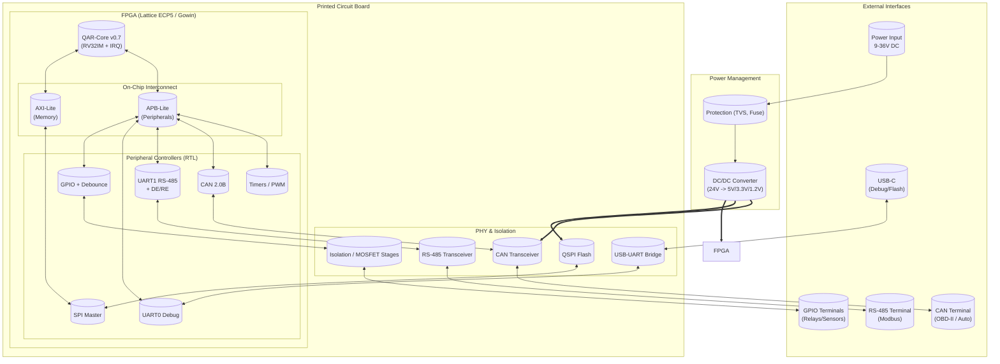

# QAR Industrial Brick (FPGA DevKit Plan)

This document captures the actionable hardware plan derived from the latest readiness review:

- Build a DIN-rail reference controller around the existing QAR Industrial Core RTL.
- Use an accessible FPGA (Lattice ECP5-45K or Gowin GW2A) so we can ship firmware today.
- Package the CPU, CAN/LIN/RS-485 PHYs, isolated GPIO, and PWM power stages into a single "brick" that automotive and industrial customers can plug in immediately.

## Goals

1. **Demonstrator** – prove QAR firmware can toggle real loads (relays, lamps, motors) and speak CAN/LIN on an actual wiring harness.
2. **Evaluation kit** – give Allur, Kia Qazaqstan, UzAuto, ERG etc. a box they can bench-test without building their own board first.
3. **Bridge to ASIC** – freeze the pinout/peripheral mix so the eventual silicon layout is straightforward.

## Functional Block Diagram

This functional block diagram (sourced from the Gemini 3 Pro analysis) now lives inside the plan so hardware engineers see the logical partitioning before schematic capture.

## Architecture Overview

| Block | Implementation | Notes |
|-------|----------------|-------|
| Compute | Lattice ECP5-45K (or Gowin GW2A-18) | 85k LUT class gives headroom for QAR core + peripherals. Use onboard SRAM as tightly-coupled IMEM/DMEM (deterministic latency). |
| Memory | 512 KB SRAM (TCM) inside FPGA, optional QSPI Flash | Prefers deterministic access instead of caches, satisfying hard real-time needs. |
| CAN | TJA1050 (or SN65HVD1040) transceiver + RJ45/automotive connector | Digital `can.v` feeds TX/RX; transceiver handles analog layer. |
| LIN/RS-485 | SN65HVD1474 (LIN) + MAX3485 (RS-485) | Connect to UART DE/RE pins already exposed in RTL. |
| GPIO | 8x isolated inputs via optocouplers, 8x high-side outputs via IPS2031 or MOSFETs | Supports automotive 12 V loads. |
| Power | 9–36 V DC input, buck to 5 V/3.3 V/1.2 V | Accepts vehicle/industrial supply range. |
| Mechanical | 6-module DIN-rail housing (Phoenix/Weidmüller compatible) | Ensures quick adoption in factory panels. |

## Interfaces & Connectors

- **CAN**: 5-pin automotive header (CANH/CANL + power) and DB9 for lab use.
- **LIN**: 3-pin keyed connector.
- **RS-485**: 2-wire + shield terminal block.
- **GPIO**: 2×8 pluggable terminal blocks (inputs isolated, outputs high-side).
- **Programming**: USB-C (FTDI) for JTAG/UART plus dedicated pogo pads for production flashing.
- **Debug UART**: shared with RS-485 using auto-direction logic already present in RTL.

## Firmware / SDK alignment

- Ship the new C-SDK (`crt0`, `hal_init`, HAL drivers) pre-built with each kit.
- Provide reference binaries (`gpio_irq_demo`, `can_loopback`, `lin_auto_header`, `timer_pwm_demo`).
- Extend `qarsim` release process to output ready-to-flash `.bin` files for the FPGA.

## Manufacturing Phases

1. **Prototype PCB (4 layers)** – route FPGA, PHYs, GPIO protection, power tree. Target < 100 × 80 mm board.
2. **Bring-up** – load current RTL bitstream, run regression firmware, verify CAN/LIN loopback on actual cables, drive relays at 12/24 V.
3. **Pilot Batch** – assemble 20–30 units for internal + customer demos.
4. **EMC Testing** – CISPR 25 / EN 61000-6-2 pre-compliance once enclosure is finalized.
5. **Customer Trials** – deploy to Allur/Kia/Astana Motors test labs and ERG/SSGPO plants.

## Open Actions

- [ ] Choose exact FPGA family & toolchain (ECP5 + open-toolflow vs Gowin + vendor tools).
- [ ] Finalize transceiver BOM (TJA1050/SN65HVD1050 for CAN, SN65HVD1474 for LIN, MAX3485 for RS-485).
- [x] Draft schematic capturing RTL pinout (CAN_TX/RX, UART_DE/RE, PWM pins etc.).
- [ ] Integrate on-board temperature/voltage monitors for automotive diagnostics.
- [ ] Publish flashing instructions (OpenOCD or vendor JTAG) alongside `qarsim` release assets.

This plan follows Gemini's recommendation: focus on delivering a tangible controller before chasing ASIC production. EOF

## Reference Schematic Topology

1. **Power Tree**
   - VIN (9–36 V) → transient suppressor (SMBJ43A) → reverse-protection FET.
   - High-efficiency buck (LMR51430 or MP1584) generates 5 V @ 2 A for IO/PHY.
   - Secondary buck/LDO chain: 5 V → 3.3 V (TPS62172) → 1.2 V core (TPS82130).
   - LC filters + common-mode chokes on every external rail entering the DIN terminals.

2. **FPGA + Memory**
   - LFE5UM5G-45F (CABGA256) + 8 MB QSPI Flash (W25Q64JV) on sysCONFIG.
   - 512 KB SRAM (IS61WV51216BLL, 16-bit bus) serves as tightly coupled DMEM/IMEM.
   - PMOD header breaks out JTAG + spare GPIO for proto work.

3. **Communication PHYs**
   - CAN: TJA1051T/3 transceiver with split termination (60 Ω || 60 Ω) and SM24CAN TVS.
   - LIN: SN65HVD1474 or MCP2004B. UART TX/RX muxed into PHY; 5 V reference derived from PHY.
   - RS-485: MAX3485E half-duplex driver tied to UART0 DE/RE. Jumper selects LIN vs RS-485.

4. **GPIO / PWM / ADC**
   - Inputs: PC817 optocouplers + SN74LVC14 buffers feeding FPGA (8 channels).
   - Outputs: IPS2031H dual high-side drivers or AOZ1284 MOSFET stages for PWM/relay loads.
   - ADC channels: RC-filtered, optional INA826 instrumentation gain, exposed on SMA/terminals.

5. **Connectors**
   - CAN: Micro-Fit 5-pin + DB9 (CiA).
   - LIN: Micro-Fit 3-pin.
   - RS-485: 3-pin pluggable terminal (A/B/GND).
   - GPIO: two 8-pin 5.08 mm terminal blocks (isolated inputs vs outputs).
   - Power: 2-pin 5.08 mm terminal with fuse + reverse diode.

6. **Programming/Debug**
   - USB-C + FT2232H (Channel A = JTAG, Channel B = UART).
   - Pogo pads: 3.3 V, GND, TCK, TMS, TDO, TDI, RESET for manufacturing fixtures.

### Key Signal Assignment

| QAR net | Destination | Notes |
|---------|-------------|-------|
| `uart_tx`/`uart_rx` | LIN or RS-485 mux | GPIO strap selects which PHY is live.
| `uart_de`/`uart_re` | RS-485 DE/RE pins | Direct drive; PHY provides fail-safe bias.
| `gpio[7:0]` | High-side MOSFET gates | PWM0/1 routed to `gpio[0:1]` using `GPIO_ALT_PWM`.
| `gpio[15:8]` | Opto-isolated inputs | Debounce handled via `GPIO_DB_*`.
| `can_tx`/`can_rx` | TJA1051 TXD/RXD | Switchable 120 Ω termination, TVS to chassis ground.
| `spi_*` | Expansion header | Sensor/expansion mezzanines.
| `i2c_*` | Header + TMP102 temp sensor | Board telemetry + potential RTC.

## Bill of Materials (initial snapshot)

| Category | Part Number | Qty | Notes |
|----------|-------------|-----|-------|
| FPGA | LFE5UM5G-45F-CABGA256 | 1 | Core of Industrial Brick.
| SRAM | IS61WV51216BLL-10TLI | 1 | 512 KB TCM.
| QSPI Flash | W25Q64JVSSIM | 1 | Bitstream + firmware.
| Buck (VIN→5V) | LMR51430 | 1 | 36 V capable.
| Buck (5→3.3V) | TPS62172 | 1 | IO rail.
| Buck/LDO (3.3→1.2V) | TPS82130 | 1 | FPGA core.
| CAN PHY | TJA1051T/3 | 1 | Automotive grade.
| LIN PHY | SN65HVD1474 | 1 | LIN 2.1 compliance.
| RS-485 PHY | MAX3485EESA | 1 | Half-duplex DE/RE pins.
| Optocoupler | PC817C | 8 | Isolated inputs.
| High-side driver | IPS2031H | 4 | 8 PWM/relay outputs.
| PWM MOSFET alt. | AOZ1284DI + FDN340P | 4 | Backup discrete stage.
| TVS (CAN) | SM24CANB | 1 | Load-dump protection.
| Bulk capacitors | 100 µF/50 V + 10 µF MLCC | assorted | On VIN + each rail.
| Temp sensor | TMP102AIDRLT | 1 | Board telemetry via I²C.
| USB/JTAG | FT2232H mini-module | 1 | Programming + UART console.
| Connectors | Micro-Fit/terminal blocks | assorted | IO + power interfaces.

The BOM will keep evolving with schematic capture, but these parts anchor procurement and component research.

